# Product Requirements Document: Master AI Agent Service

- **Version:** 1.0
- **Date:** July 30, 2025
- **Status:** Final Draft for Implementation
- **Author:** NIOV Labs

## 1. Executive Summary

The Master AI Agent Service is a powerful, scalable API platform designed to orchestrate a team of specialized AI agents. Instead of relying on a single, monolithic AI, this service acts as a "master conductor," intelligently delegating tasks to "child agents," each an expert in a specific domain (e.g., research, code generation).

This service introduces a new paradigm of interaction where users can provide complex, natural language instructions that are dynamically parsed and combined with secure, internal context documents. The result is a highly adaptable and controllable AI system capable of performing nuanced tasks far beyond the scope of a standard chatbot. Key features include real-time streaming for an engaging user experience, an asynchronous architecture to handle long-running tasks, and a modular design built for future expansion.

## 2. Goals & Objectives

*   **To Decouple AI Capabilities:** Create a system where specialized agents can be developed, deployed, and scaled independently.
*   **To Enable Dynamic Control:** Move beyond hard-coded prompts to a system where agent instructions are dynamically generated from user requests and a secure context library.
*   **To Provide a Production-Grade Interface:** Deliver the agent capabilities through a robust, scalable, and asynchronous FastAPI service.
*   **To Enhance User Engagement:** Implement real-time streaming of AI responses to create a modern and interactive client-side experience.
*   **To Ensure Observability and Scalability:** Build on a foundation that supports detailed tracing, persistent state, and horizontal scaling.

## 3. Core Features & Requirements

| Feature ID | Feature Name | Description (What it does) | Technical Implementation (How it works) |
| :--- | :--- | :--- | :--- |
| **F-01** | **Asynchronous Task API** | Allows a client to submit a long-running task and immediately receive a `task_id`. The client can then poll an endpoint with this ID to check the status and retrieve the result when ready. This prevents client timeouts and enables complex workflows. | - `POST /api/v1/tasks` endpoint accepts the job. - Starts the agent workflow in a background process (`BackgroundTasks`). - Immediately returns a `202 Accepted` with the `task_id`. - `GET /api/v1/tasks/{task_id}` endpoint returns the status (`PENDING`, `RUNNING`, `COMPLETED`, `FAILED`) and final result. |
| **F-02** | **Real-Time Streaming** | Provides an endpoint that streams the AI agent's response token-by-token as it's being generated. This brings the client-side application to life, showing the agent "thinking" in real time. | - `GET /api/v1/tasks/stream` endpoint uses Server-Sent Events (SSE). - FastAPI's `StreamingResponse` is used with a `text/event-stream` media type. - The child agent uses the `.stream()` method, and the service `yields` formatted data chunks to the client. |
| **F-03** | **Dynamic Instruction Parsing** | Intelligently deconstructs a user's natural language request into structured components (core task, persona, formatting rules, constraints) before any work is done. | - A "meta-agent" node is the first step in the LangGraph workflow. - It uses an LLM with `.with_structured_output(PydanticModel)` to parse the raw user input into a `ParsedInstructions` object. |
| **F-04** | **Centralized Context Store** | Provides a secure repository for trusted, internal documents (e.g., style guides, policies). The Master Agent can dynamically inject this context into a child agent's prompt for a specific task. | - A dedicated MongoDB collection (simulated as a dictionary for now) stores context documents. - `POST /contexts` and `GET /contexts/{id}` endpoints allow for secure management of this knowledge base. - The Master Agent fetches and adds this context to the child agent's instructions based on the user's request. |
| **F-05** | **Multi-Agent Orchestration** | Implements a master-child agent architecture where a central Master Agent delegates work to specialized child agents. The initial implementation includes one `ResearchAgent`. | - Uses `LangGraph` to define the orchestration flow as a state machine. - The Master Agent contains the graph logic (parsing, delegating). - Child agents are standalone classes adhering to a common `AgentInterface`, making the system modular and extensible. |

## 4. System Architecture & Design

### 4.1. Final File Structure

This structure separates concerns, enables scalability, and follows modern Python application design principles.

